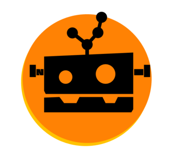

# gitrobotic
A GUI for git built using Electron React, and [Nodegit](http://www.nodegit.org/). I created this project to get a grasp on the fundamentals of React, and javascript in general.

## Features
* View the commits belonging to a branch by selecting the branch name.
* Learn more about a particular commit; like the changes pertaining to the commit, by clicking on it.
* View complete diff of unstaged changes in Staging Area. Also, you can only choose to stage certain files to commit them later.
* Commit individual lines/hunks by selecting them in the selective staging area.
* Gitrobotic continually watches files for changes and updates itself automatically :)

## TODO
* Add tagging capability.
* Allow users to clone repos.
* Push/Pull functionality.

## License
MIT
